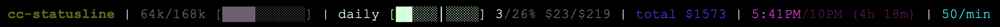

# Claude Statusline

A custom statusline for [Claude Code 2.x](https://claude.com/claude-code) that provides real-time usage tracking with an intelligent multi-layer progress visualization, helping you stay aware of context windows, costs, and session limits.

## Features

- **Accurate context window tracking** - Counts reserved context space for Claude Sonnet 4.5
- **Cost usage tracking** - Re-calibrated to official '/usage' tracker, inspired by [Claude-Code-Usage-Monitor](https://github.com/Maciek-roboblog/Claude-Code-Usage-Monitor), based on real Sonnet 4.5 API pricing
- **Daily usage tracking** - 24-hour cycle tracker aligned with weekly reset schedule, shows percentage of weekly limit consumed today with end-of-day projection
- **Multi-layer progression system** - Configurable thresholds (default: 30%/50%/100%) with auto-calculated display speeds for optimal visual feedback
- **Weekly usage tracking** - Calibrated to official /usage data
- **Linear cost prediction** - Projects usage to end of 5-hour session and end of day
- **5-hour session reset/left time tracking** - Displays countdown until session limit resets
- **Active Claude Code sessions tracking** - Monitors concurrent sessions across projects
- **Conditional section rendering** - Only computes enabled sections for improved performance
- **Lightweight bash implementation** - Runs entirely in shell, no heavy dependencies
- **Fully customizable** - Config file with feature toggles for enabling/disabling components
- **Privacy-first design** - Personal config excluded from version control
- **Tested on Max20 plan and macOS** - Compatible with Linux and WSL

## Platform Support

- **macOS** - ✅ Fully tested and supported
- **Linux** - ✅ Supported (requires bash, jq, npm)
- **Windows** - ⚠️ WSL or Git Bash only (not native CMD/PowerShell)

## Example Output

```
.claude | 45k/168k [████████░░] | $32/$140 [█████░░░░░] 23% | daily [██░░░░░░░░] 6% | weekly 18% | 3h 42m | ×2
```


*Screenshot showing the multi-layer color system in action*

## Installation

### Quick Install (Recommended)

One command to install everything:

```bash
curl -sSL https://raw.githubusercontent.com/hell0github/claude-statusline/main/install.sh | bash
```

The installer will:
- ✅ Check dependencies (jq, ccusage)
- ✅ Copy files to ~/.claude/
- ✅ Prompt for your plan (pro/max5x/max20x)
- ✅ Ask permission before modifying settings.json
- ✅ Create backup of existing settings
- ✅ Guide you through setup

### Manual Installation

**Prerequisites:** [Claude Code](https://claude.com/claude-code), `jq` (`brew install jq`), `ccusage` (`npm install -g ccusage`)

```bash
# Clone repository to Projects directory
git clone https://github.com/hell0github/claude-statusline.git ~/Projects/cc-statusline
cd ~/Projects/cc-statusline

# Run installer (recommended)
./install.sh

# OR set up manually:
# 1. Create shim in ~/.claude/
cat > ~/.claude/statusline.sh << 'EOF'
#!/bin/bash
exec "$HOME/Projects/cc-statusline/src/statusline.sh" "$@"
EOF
chmod +x ~/.claude/statusline.sh

# 2. Copy example config
cp config/config.example.json config/config.json

# 3. Edit config (set your plan)
nano config/config.json

# 4. Add to ~/.claude/settings.json:
{
  "statusLine": {
    "type": "command",
    "command": "~/.claude/statusline.sh"
  }
}

# Restart Claude Code
```

## Configuration

Edit `~/Projects/cc-statusline/config/config.json` to customize your statusline:

- **`user.plan`** - Set to `"pro"`, `"max5x"`, or `"max20x"` (your subscription tier)
- **`limits.*`** - Adjust weekly/context/cost limits if needed
  - Note: `pro` and `max5x` weekly limits are estimated - only `max20x` (850) has been verified
- **`display.*`** - Change bar length, performance tuning
- **`colors.*`** - Customize ANSI color codes for each element
- **`multi_layer.*`** - Adjust layer thresholds (30%/50%/100%) for 5-hour window - multipliers auto-calculated
- **`daily_layer.*`** - Adjust daily thresholds (4.76%/9.52%/14.29% of weekly limit) - represents 1/3, 2/3, and full daily expected usage
- **`sections.*`** - Toggle visibility of individual sections (directory, context, 5-hour window, daily, weekly, timer, sessions)
- **`tracking.*`** - Configure weekly tracking scheme
  - **Required for daily tracking**: Set `official_reset_date` to enable daily usage feature (see Weekly Usage Tracking section below)

See `config/config.example.json` for all available options with detailed comments.

## Handling Untracked Costs (Deleted Transcripts)

**Problem**: When you use Claude Code's `clear` or `compact` commands to delete transcripts, the usage data is permanently removed from ccusage tracking (which reads from transcript files). This creates a discrepancy:
- **Anthropic Console**: Still shows full usage (server-side records)
- **Statusline**: Shows lower percentage (missing deleted transcript costs)

**Solution**: Set `tracking.weekly_baseline_percent` to compensate for untracked costs.

### How to Calibrate

1. **Check your Anthropic console** for current weekly usage percentage
2. **Check your statusline** for current weekly usage percentage
3. **Calculate the gap**: `console_percent - statusline_percent`
4. **Set baseline**: Edit `config/config.json`:
   ```json
   {
     "tracking": {
       "weekly_baseline_percent": 5
     }
   }
   ```

### Example

Your observed reality:
- Anthropic console shows: **15% weekly usage**
- Statusline shows: **10% weekly usage**
- Gap: `15% - 10% = 5%`
- Configuration: Set `"weekly_baseline_percent": 5`
- Result: Statusline now shows **15%** (10% tracked + 5% baseline)

**Note**: The baseline applies to **all tracking schemes** (both `ccusage` and `ccusage_r`). If you don't delete transcripts, keep this at `0` (default).

## Daily and Weekly Usage Tracking Calibration

**Note**: By default, weekly tracking uses ISO weeks (Monday-Sunday) via ccusage. This may show different percentages than the Anthropic console, which uses custom reset cycles (e.g., Wednesday 3pm → Wednesday 3pm).

### Configure Official Reset Schedule (Enables Daily Tracker)

Setting the official reset date **enables two features**:
1. **Daily usage tracking** - 24-hour cycle tracker with end-of-day projection
2. **Weekly tracking calibration** - Match Anthropic console percentage exactly (when using `ccusage_r` scheme)

**Setup steps:**

1. **Find your reset date** at [console.anthropic.com](https://console.anthropic.com):
   - Go to Usage tab
   - Look for "Resets [date/time]" text (e.g., "Resets Oct 8, 3pm")

2. **Update your config** (`~/Projects/cc-statusline/config/config.json`):
```json
{
  "tracking": {
    "weekly_scheme": "ccusage_r",
    "official_reset_date": "2025-10-08T15:00:00-07:00"
  }
}
```

3. **Format guide**:
   - `YYYY-MM-DDTHH:MM:SS±HH:MM`
   - Example: "Oct 8, 3pm Vancouver" → `2025-10-08T15:00:00-07:00` (PDT = UTC-7)
   - You only need to update this once; it auto-calculates future periods

**Results**:
- Daily tracker will appear in your statusline showing today's usage as % of weekly limit
- Weekly percentage will match Anthropic console (if using `ccusage_r` scheme)

**Note**: Daily tracking works with either `ccusage` or `ccusage_r` weekly schemes - only `official_reset_date` is required.

## Troubleshooting

| Issue | Solution |
|-------|----------|
| Statusline doesn't appear | `chmod +x ~/.claude/statusline.sh` and restart Claude Code |
| "jq: command not found" | `brew install jq` (macOS) or `sudo apt-get install jq` (Linux) |
| "Window tracking unavailable" | `npm install -g ccusage` |
| Wrong usage data | Update `user.plan` in config, verify with `ccusage blocks --active` |
| Colors not working | Check terminal 256-color support |

## Architecture

This plugin uses a **shim architecture** for clean separation:

```
Claude Code → ~/.claude/statusline.sh (2-line shim)
                      ↓
              ~/Projects/cc-statusline/src/statusline.sh (implementation)
```

The shim provides a stable interface while allowing flexible reorganization of the implementation.

## File Structure

```
~/Projects/cc-statusline/          # Installation directory
├── src/                           # Source code
│   ├── statusline.sh             # Main implementation
│   └── statusline-utils.sh       # Daily/weekly tracking utilities
├── config/                        # Configuration
│   ├── config.json               # Your settings (gitignored)
│   └── config.example.json       # Template
├── data/                          # Runtime data (gitignored)
│   ├── .daily_cache              # Daily cost cache
│   ├── .official_weekly_cache    # Weekly cost cache
│   └── statusline-data.json      # Legacy cache (deprecated)
├── example/                       # Example screenshot
├── install.sh                     # Automated installer
├── README.md                      # This file
├── CLAUDE.md                      # Development guide
├── LICENSE
└── .gitignore

~/.claude/
└── statusline.sh                 # Shim script (delegates to src/)
```

## License

MIT License - See [LICENSE](LICENSE) file for details.

Free to use, modify, and distribute. No warranty provided.

## For Developers

Contributing or modifying the plugin? See [CLAUDE.md](CLAUDE.md) for:
- Architecture explanation (shim pattern)
- Development guidelines
- Testing procedures
- Git workflow conventions
- Path reference standards

## Acknowledgments

- Plugin for [Claude Code](https://claude.com/claude-code)
- Uses [ccusage](https://www.npmjs.com/package/ccusage) for usage tracking
- Inspired by [Claude-Code-Usage-Monitor](https://github.com/Maciek-roboblog/Claude-Code-Usage-Monitor)
- Thanks to the community for better usage awareness in AI-assisted coding

---

**Note:** This is an unofficial third-party tool and is not affiliated with or endorsed by Anthropic.
